# library# 图书借阅管理系统 — 流程图

> 使用 Mermaid 语法绘制，在支持 Mermaid 的 Markdown 渲染器中可直接查看（GitHub、VS Code + 插件等）。

---

## 一、系统主流程图

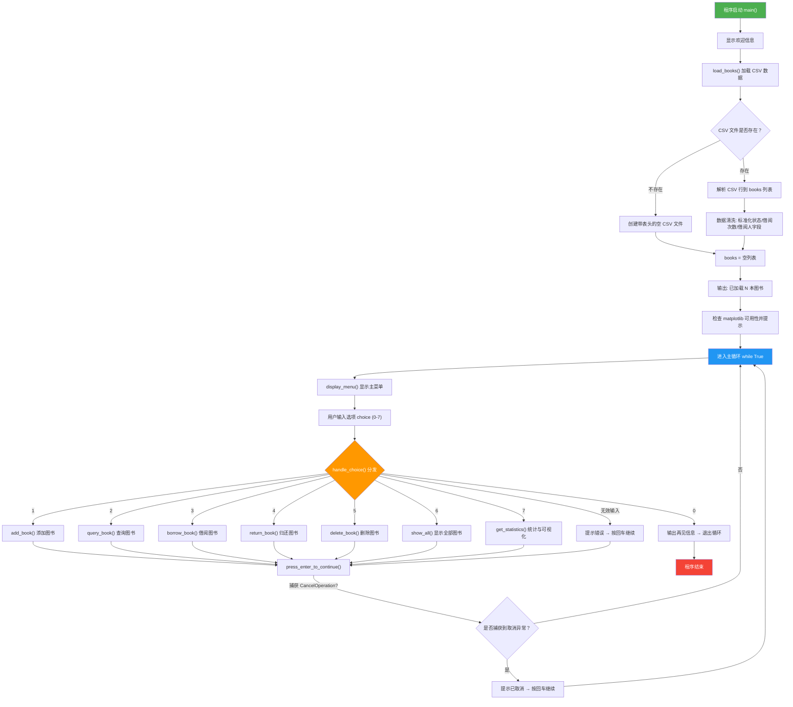

---

## 二、数据加载模块 — load_books()

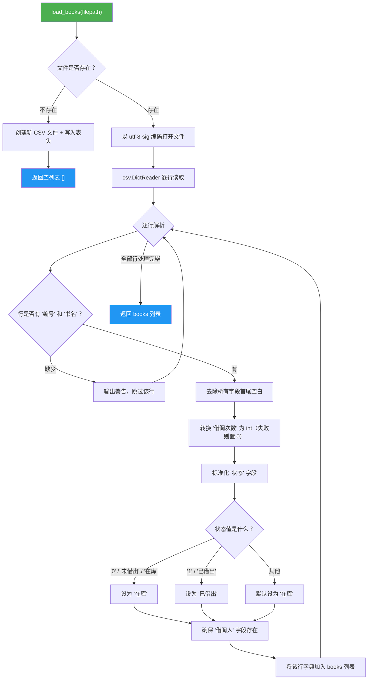

---

## 三、数据保存模块 — save_books()

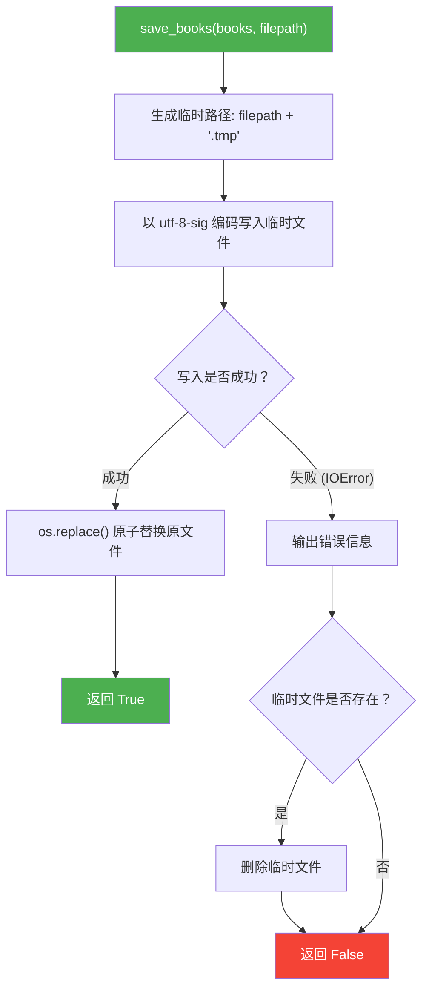

---

## 四、操作日志模块 — log_history()

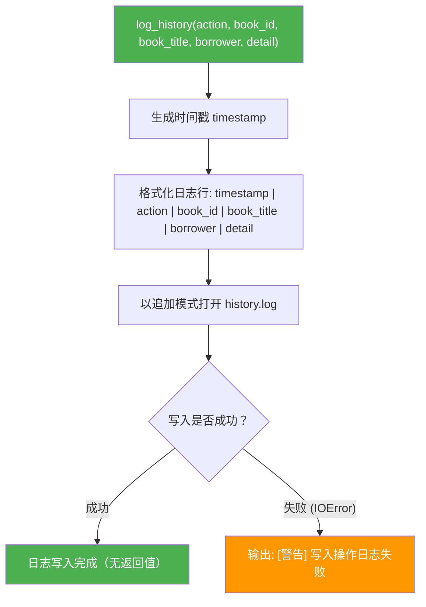

---

## 五、添加图书模块 — add_book()

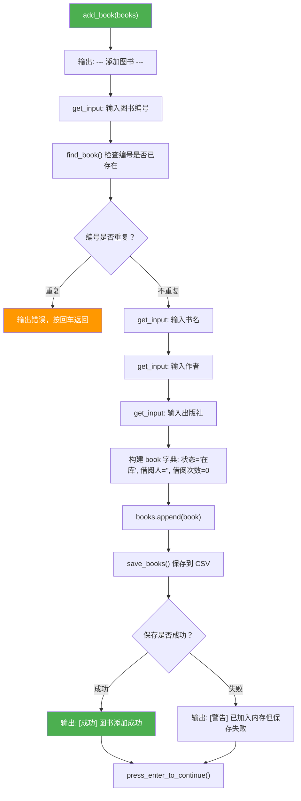

---

## 六、查询图书模块 — query_book()

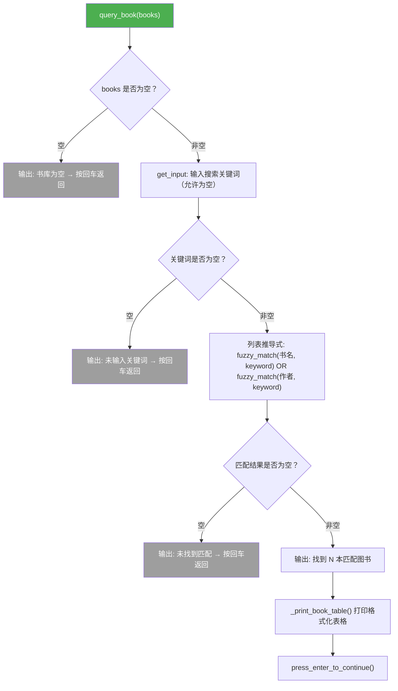

---

## 七、借阅图书模块 — borrow_book()

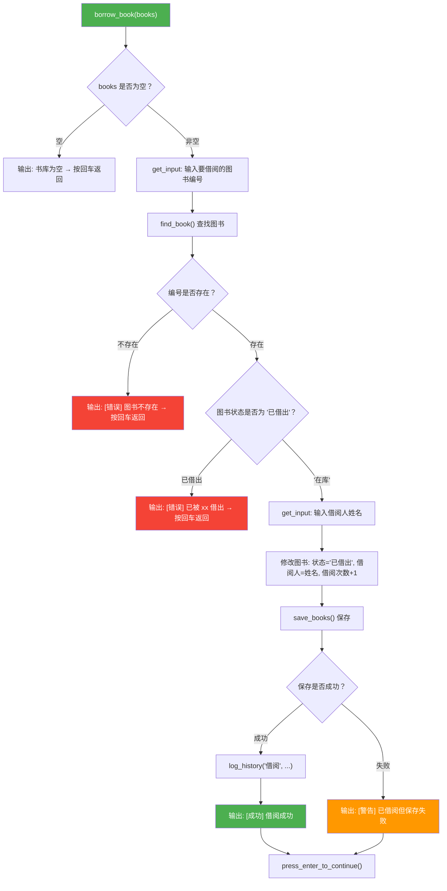

---

## 八、归还图书模块 — return_book()

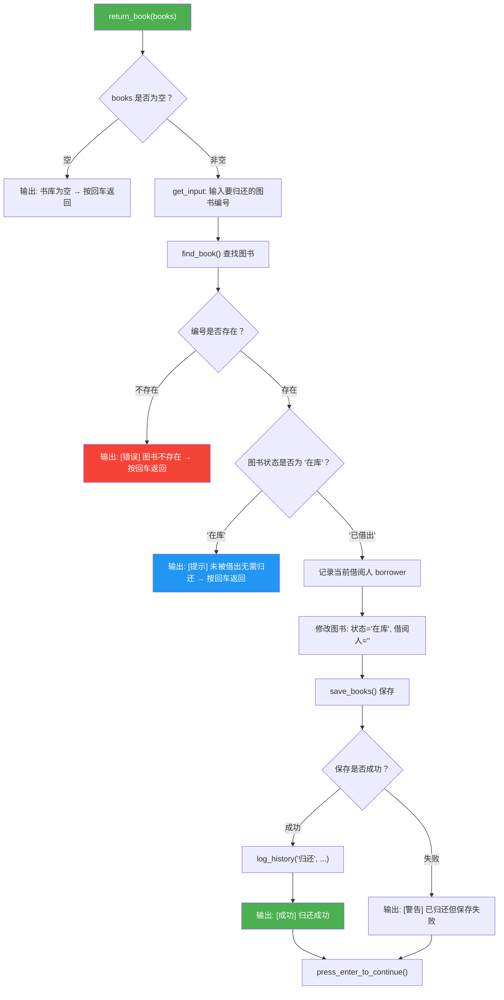

---

## 九、删除图书模块 — delete_book()

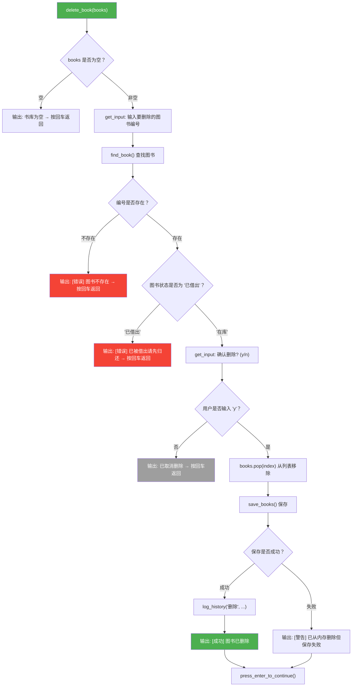

---

## 十、显示全部图书模块 — show_all()

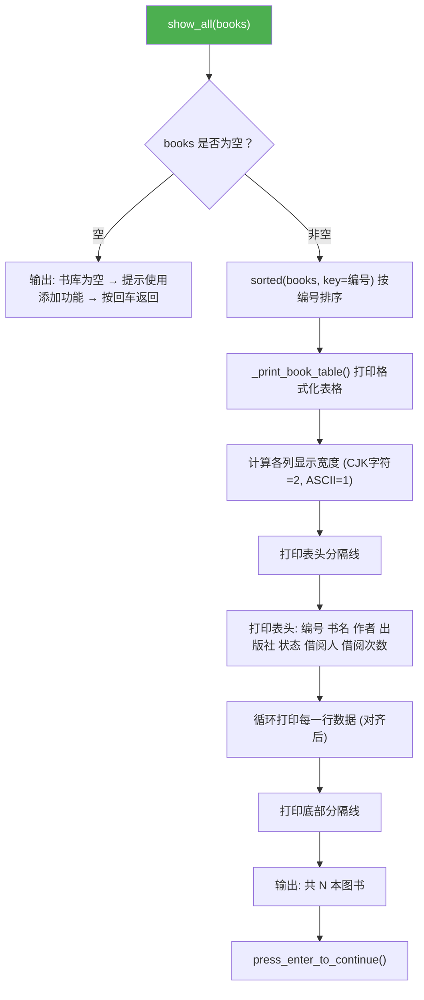

---

## 十一、统计与可视化模块 — get_statistics()

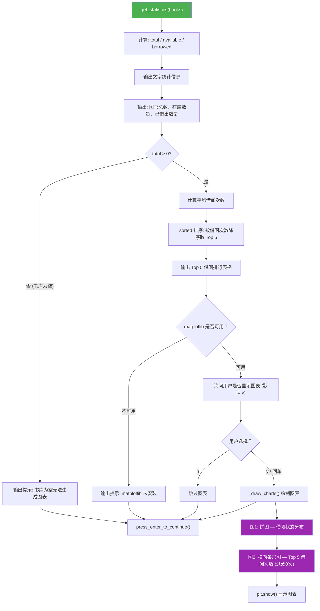

---

## 十二、菜单分发模块 — handle_choice()

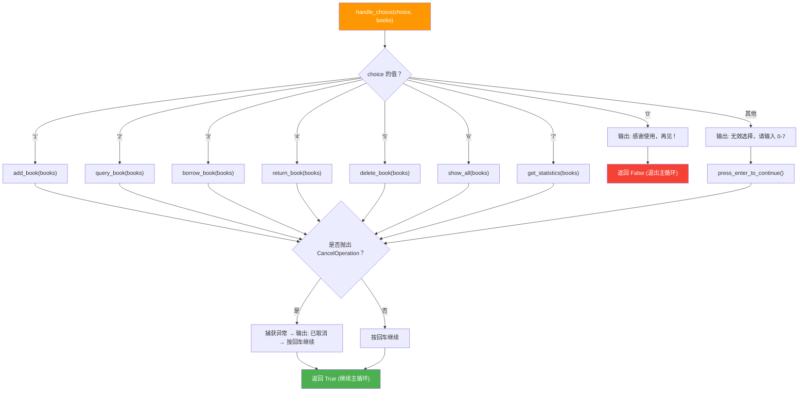

---

## 十三、各模块关系总览

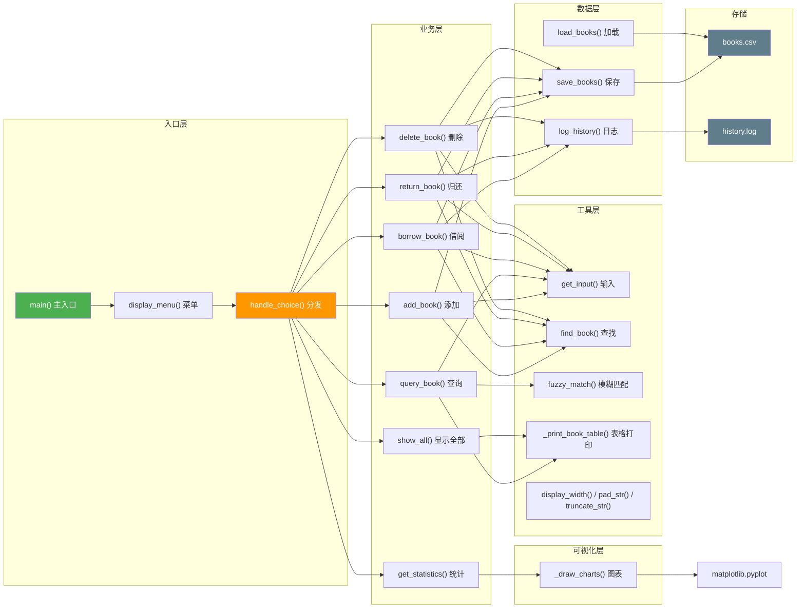
